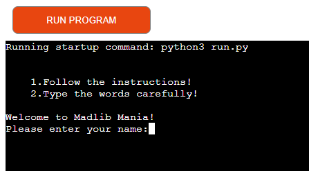
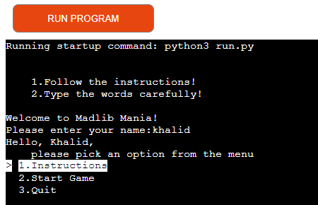
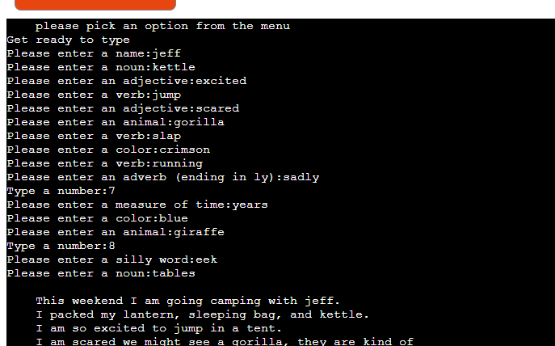
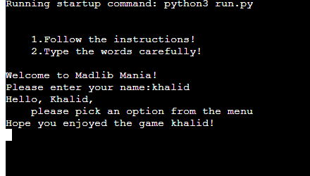
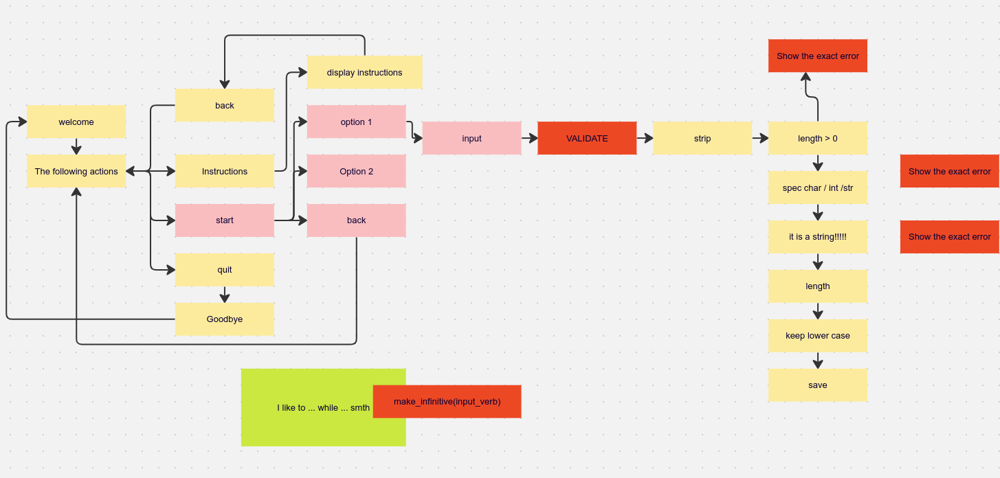
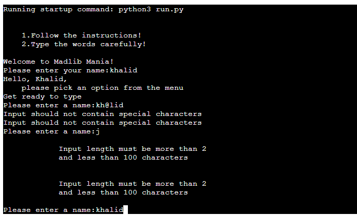
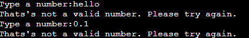
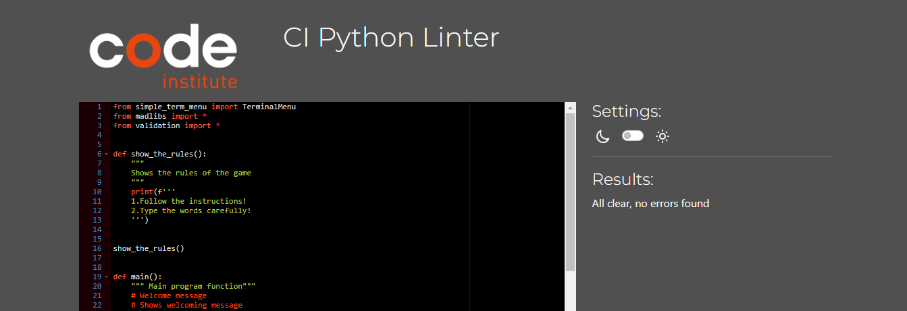
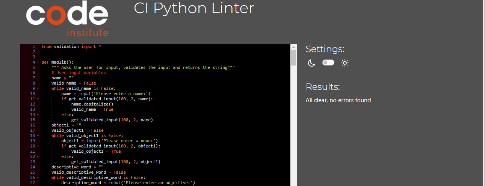
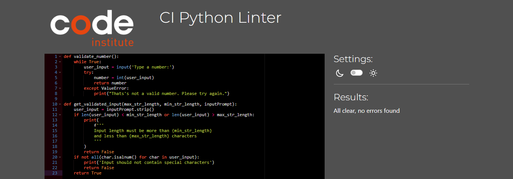

# Madlib Mania


*The link to [Madlib Mania](https://madlib-mania-be225d81841f.herokuapp.com/)*

Madlib Mania is a Python terminal project game where the user is prompted for a list of words
to substitute blanks in various stories. These word substitutions have a humorous effect when the
resulting story is read out loud.

Users can quickly learn the rules of the game and type any words according to the provided instructions.

## How to play:

  1. As soon as the page is loaded, click 'RUN PROGRAM'.
  2. Introduce yourself to the program.
  3. Learn the rules.
  4. Type the words according to the instructions.
  5. Read the story gradually by hitting 'Enter' on your keyboard and have some fun.
  6. As soon as you are sick and tired of the game, choose "Quit"

## User Stories
### First Time Visitor Goals:

* As a First Time Visitor, I want to quickly understand the program's primary purpose so that I can learn more about this program.
* As a First Time Visitor, I want to navigate through the program easily so that I can find the content.

### Frequent Visitor Goals:
* As a Frequent User, I want to be able to use different words for the inputs so that I can receive various experiences.
* As a Frequent User, I want the stories to be readable all the time so that I can read stories without difficulties. 

## Features
  
  - **When the program is loaded**

  The user can see a welcoming message which engages to start playing and the 
  prompt to enter their name:
  
  

  - **When the user types a name.**

  - Sends personal greetings and short instruction on the next step;

  - Shows the terminal menu with three options:

    - Instructions;

    - Start Game;

    - Quit;

      

 The user can manipulate the terminal menu with the arrow keys to choose an option and the enter key to confirm the choice.

  - **When the user chose "Instructions"**

  The user will see the main rules of the game which are required to be followed.

  - **When the user chose "Start Game"**

  The program will show the sub-menu with the following options to choose from:

  - Story 1

  - Story 2

  - Story 3

  - Go Back


  

  Here the user chooses which story they want to play with.

- **When the user chooses a particular story**

  The program alerts the user to be ready to type the words.

  

  Then, the user will be asked to type words according to the parts of speech. 
  When all words are typed, the user will receive the whole story based on the keywords which he or she typed before.

    - **When the user chooses "Go Back"**


  The user will be taken back to the main menu

  

  - **When the user chooses "Quit" on the main menu**
    The user will see a goodbye message, and the program will be stopped.
    
  

## Flowchart

The flowchart represents the logic of the application:

  

## Technologies Used

### Languages:

- [Python 3.8.5](https://www.python.org/downloads/release/python-385/): used to anchor the project and direct all application behavior

### Frameworks/Libraries, Programmes and Tools:
#### Python modules/packages:

##### Third-party imports:

- [Simple Terminal Menu](https://pypi.org/project/simple-term-menu/) was used to implement the menu.

#### Other tools:

- [Git](https://git-scm.com/) was used for the version control of the website.
- [GitHub](https://github.com/) was used to host the code of the website.

## Bugs

+ **Solved bugs**


1. The functions ```madlib```, ```madlib_2``` and ```madlib_3``` were not printing out the completed stories after the user input all the inputs.

    - *Solutions:* I was not calling the print function on the variables that held the stories.

    
+ **Unsolved bugs**

    - None.

    ## Testing

The program was tested constantly during its development process to ensure user inputs made sense:





### Validators

Code Institutes [online validation tool](https://pep8ci.herokuapp.com/) was used to ensure that all of the project's Python source code is [Pep 8-compliant](https://legacy.python.org/dev/peps/pep-0008/). This checking was done manually by copying python code and pasting it into the validator.

No errors were found:






## Deployment

- The program was deployed to [Heroku](https://dashboard.heroku.com).

### To deploy the project to Heroku so it can be run as a remote web application:
- Clone the repository:
  - Open a folder on your computer with the terminal.
  - Run the following command
  - `git clone https://github.com/khalidcodes1/madlib-mania.git`

  - Create your own GitHub repository to host the code.
  - Run the command `git remote set-url origin <Your GitHub Repo Path>` to set the remote repository location to your repository.

  - Push the files to your repository with the following command:
  `git push`
  - Create a Heroku account if you don't already have one here [Heroku](https://dashboard.heroku.com).
  - Create a new Heroku application on the following page here [New Heroku App](https://dashboard.heroku.com/apps):

  - Go to the Deploy tab:

  - Link your GitHub account and connect the application to the repository you created.

  - Go to the Settings tab:

  - Click "Add buildpack":

  - Add the Python and Node.js buildpacks in that order:

  - Click "Reveal Config Vars."

  - Add 1 new Config Vars:
      - Key: PORT Value: 8000
      - *This Config was provided by [CODE INSTITUTE](https://codeinstitute.net/)*.

  - Go back to the Deploy tab:

  - Click "Deploy Branch":

      - Wait for the completion of the deployment.

  - Click "Open app" to launch the application inside a web page.

  ## Acknowledgements

[Iuliia Konovalova](https://github.com/IuliiaKonovalova)

I am tremendously thankful to my mentor Iuliia Konovalova for her guidance and valuable feedback!


