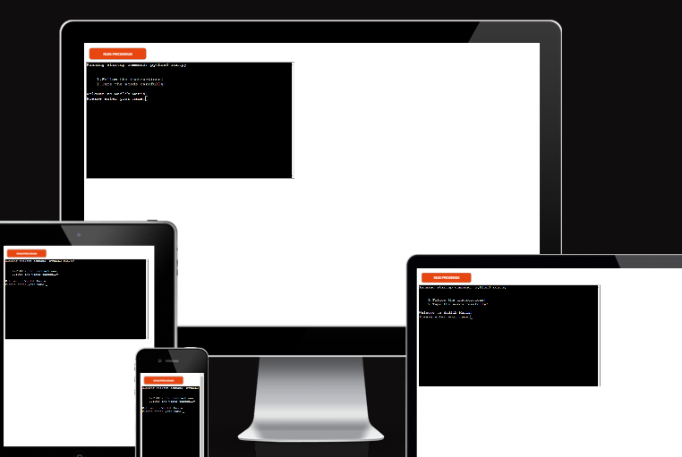

# Madlib Mania

*The link to [Madlib Mania](https://madlib-mania-be225d81841f.herokuapp.com/)*

Madlib Mania is a Python terminal project game where the user is prompted for a list of words
to substitute blanks in various stories. These word substitutions have a humorous effect when the
resulting story is read out loud.

Users can quickly learn the rules of the game and type any words according to the provided instructions.

