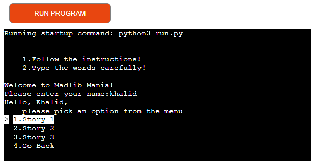

# Madlib Mania

*The link to [Madlib Mania](https://madlib-mania-be225d81841f.herokuapp.com/)*

Madlib Mania is a Python terminal project game where the user is prompted for a list of words
to substitute blanks in various stories. These word substitutions have a humorous effect when the
resulting story is read out loud.

Users can quickly learn the rules of the game and type any words according to the provided instructions.

## How to play:

  1. As soon as the page is loaded, click 'RUN PROGRAM'.
  2. Introduce yourself to the program.
  3. Learn the rules.
  4. Type the words according to the instructions.
  5. Read the story gradually by hitting 'Enter' on your keyboard and have some fun.
  6. As soon as you are sick and tired of the game, choose "Quit"

## User Stories
### First Time Visitor Goals:

* As a First Time Visitor, I want to quickly understand the program's primary purpose so that I can learn more about this program.
* As a First Time Visitor, I want to navigate through the program easily so that I can find the content.

### Frequent Visitor Goals:
* As a Frequent User, I want to be able to use different words for the inputs so that I can receive various experiences.
* As a Frequent User, I want the stories to be readable all the time so that I can read stories without difficulties. 

## Features
  
  - **When the program is loaded**

  The user can see a welcoming message which engages to start playing and the 
  prompt to enter their name:
  
  

  - **When the user types a name.**

  - Sends personal greetings and short instruction on the next step;

  - Shows the terminal menu with three options:

    - Instructions;

    - Start Game;

    - Quit;

      

 The user can manipulate the terminal menu with the arrow keys to choose an option and the enter key to confirm the choice.

  - **When the user chose "Instructions"**

  The user will see the main rules of the game which are required to be followed.

  - **When the user chose "Start Game"**

  The program will show the sub-menu with the following options to choose from:

  - Story 1

  - Story 2

  - Story 3

  - Go Back

  

  Here the user chooses which story they want to play with.

- **When the user chose a particular story**

  The program alerts the user to be ready to type the words.

  

  Then, the user will be asked to type words according to the parts of speech. 
  When all words are typed, the user will receive the whole story based on the keywords which he or she typed before.

